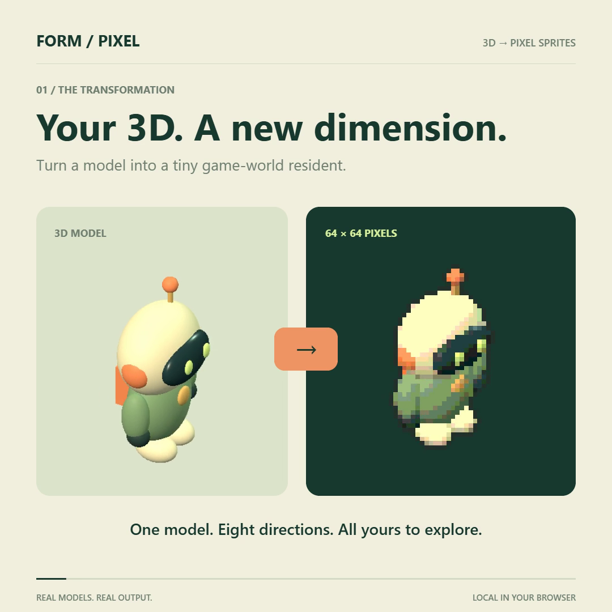

# FORM / PIXEL

**Turn a 3D model into a pixel character. Then take it into a dungeon.**

A small browser workshop for experimenting with what your models could become: a hero, a prop, a weapon — or a sword that decides to be the hero.

Built for indie game developers, 3D artists and people who want to make something strange. Bring a GLB, choose a pixel style, bake eight directions and try the result in a playable adventure.

**Early playable prototype · Local setup · German UI · No hosted demo yet**

[Get started](#run-locally) · [Report a bug or share a creation](https://github.com/mikelninh/form-pixel/issues/new/choose) · [Contribute](CONTRIBUTING.md)



*An original demo model, rendered through the workshop's conversion pipeline. Whole-object motion; no generated rig or walk cycle.*

## The experiment

**What is the most unexpected object you can turn into a dungeon hero?**

Start with the included sword, then try your own model. Share a short clip and one thing that got in your way. You can play as any model, carry it as cosmetic equipment, or use it as a prop. No account or API key is needed to run the workshop; files are processed locally.

## Run locally

You need **Node.js 20+**, **npm**, **Git**, and a modern browser with WebGL. Run:

```sh
git clone https://github.com/mikelninh/form-pixel.git
cd form-pixel
npm ci --no-audit --no-fund
npm start
```

Open http://127.0.0.1:4177/ on the same computer. Keep the terminal running. This is a local development server, not a public demo URL.

Without Git: use **Code → Download ZIP**, extract it, then run the last two commands inside that folder. Start with a bundled example; no 3D file is required.

## Try this first

1. Choose **SONNENKLINGE** (a sword), **MOMO**, or import your own GLB with **Eigenes GLB öffnen**.
2. Try Studio, Pocket or Arcade. Rotate the view and compare the pixel silhouette.
3. Choose **Als Held in die lebende Ruine** to play as that model.
4. Pick sword, magic or bow. Click/tap to move, or use WASD/arrows. **E** attacks; hold E to charge a bow shot. **Space** dashes. Visible buttons also work.
5. To carry a model as equipment instead, set **Verwendung** to **Werkzeug / Ausrüstung**, add it with **In die Ruinen-Ablage legen**, then choose your hero. Equipment is currently cosmetic. Props appear at fixed positions near home; the shelf holds three items for the browser session.

## What is here

- Eleven examples, including original procedural models and credited third-party samples.
- Local GLB import, up to 40 MB, with embedded textures.
- Eight directions, 48/64/96 px output, three camera presets, palettes and outlines.
- Still, float and hop motions applied to the whole model.
- Transparent sprite-sheet PNG, animation JSON and a Godot 4 integration example in a ZIP export.
- Two adventure chapters; the second includes three combat rooms, class abilities, a boss and an optional encounter.
- Local game saves and feedback, JSON export, plus an opt-in GitHub issue draft you review before opening.

## Boundaries

This is a prototype. It does not generate a skeleton or a walk cycle, and it does not play imported skeletal animations. Draco, Meshopt and KTX2 decoders are not configured. Usage suggestions rely on example metadata, names and rig hints; they are editable, not reliable semantic recognition. All models can be chosen as heroes.

There is no multiplayer, dedicated feedback backend, VeVe connection or VeVe exporter. Conversion does not grant rights to an imported model. Save identity currently uses the source name, so identically named imports can share progress.

## Make something unexpected

Show us a 5–10 second clip, say which model you used and tell us one thing that worked and one thing that got in your way. Please share only models you are allowed to redistribute; a screenshot and model source link are often enough for an issue.

For feedback, use the in-app **Feedback geben** → **GitHub-Entwurf prüfen** flow or [choose an issue template](https://github.com/mikelninh/form-pixel/issues/new/choose). GitHub requires an account. Reports are public when submitted; no model or private filename is attached automatically. Local feedback is not sent unless you choose to share it.

See [CONTRIBUTING.md](CONTRIBUTING.md) for small starter tasks and useful bug reports.

## Code map

- `app.js`: import, rendering, sprite baking, export and adventure handoff.
- `appearance.js`, `examples.js`, `asset-usage.js`: visual settings, examples and usage suggestions.
- `ruins-core.js`: deterministic movement, combat and progression.
- `ruins-art.js`: pixel-world rendering.
- `ruins.js`, `ruins.html`, `ruins.css`: game integration and interface.
- `heimkehr-*` and `heimkehr.*`: the first chapter.
- `assets/`: example files, previews and their source/license notices.

## Core checks

These checks require Node.js and do not require a browser automation setup:

```sh
npm test
```

Runs five scripts covering feedback draft safety and the three adventure implementations. GitHub Actions runs these checks on pushes and pull requests. They validate logic, not visual quality or a full human playthrough.

## If something does not work

- **Blank preview:** use a WebGL-capable browser and enable hardware acceleration if it is disabled. Try a bundled example first.
- **Model fails to import:** use an uncompressed GLB under 40 MB with embedded textures; see the limitations above.
- **Port already in use:** close the other local server, or set the `PORT` environment variable before starting.
- **Feedback not received:** saving locally does not send it. Open the GitHub draft, review it and submit the issue yourself.

## License

Original project code and original procedural models are available under the [MIT License](LICENSE). Third-party models and dependencies keep their own terms; see [THIRD_PARTY.md](THIRD_PARTY.md) and the notices in assets/. No VeVe models are included.

## Feedback to improvements

Our first milestone is five independent runs, three shared creations and one contributed improvement. These are targets, not measured results. See [FEEDBACK_LOOP.md](FEEDBACK_LOOP.md) for how reports become changes and retests.
